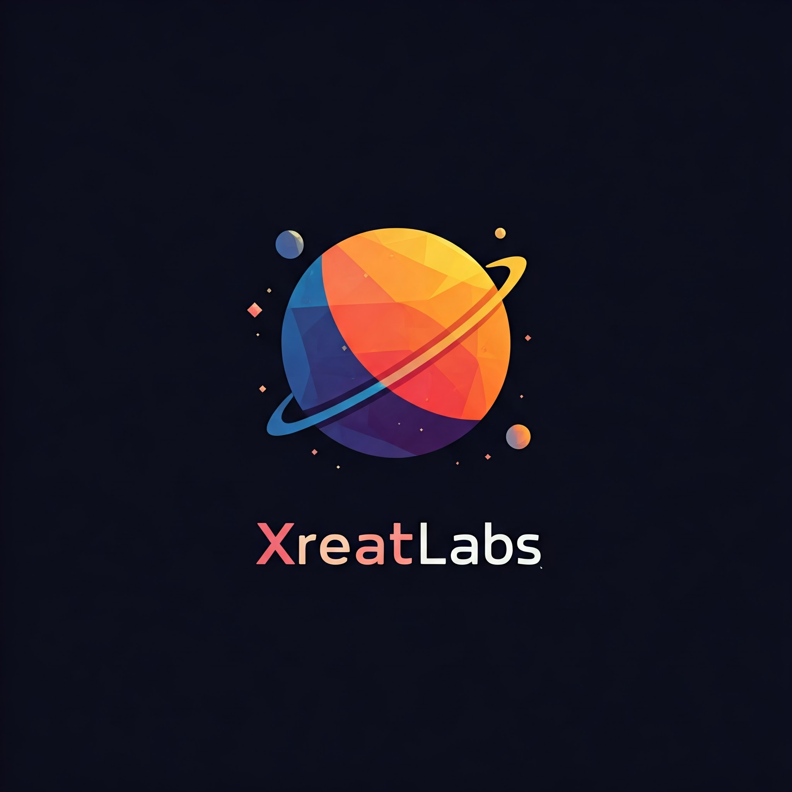

  

###Hey, we are Xreatlabs👋

Welcome to Xreatlabs GitHub! We are  passionate to make easy Script from Install. we specialize in Making quick Installation script and love creating innovative solutions. Currently, we are focusing on quick installation.

### 🚀 Technologies We Use:
- **Languages:** Python, JavaScript, Go
- **Frameworks:** React, Node.js
- **Cloud/DevOps:** AWS, Docker, Kubernetes
- **Database:** PostgreSQL, MongoDB

### 📈 GitHub Stats:

### 💻 Pinned Projects:
- [Project 1](https://github.com/Xreatlabs/mcsoftware-installer ): it install Minecraft server software like Paper,purper,bungee, velocity,etc.
- [Project 2](https://github.com/Xreatlabs/panel-installer ): it install Game panel in 1 click.

### 🌐 Connect with Us:
- [Twitter](https://x.com/xreatlabs?t=zZcHezfQN1UUzz_1nwXimw&s=09)
- [Instagram](https://www.instagram.com/invites/contact/?igsh=vak7oe8t1ft0&utm_content=vcv37yn)
- [Discord](https://discord.gg/yAgRafG6JD)
